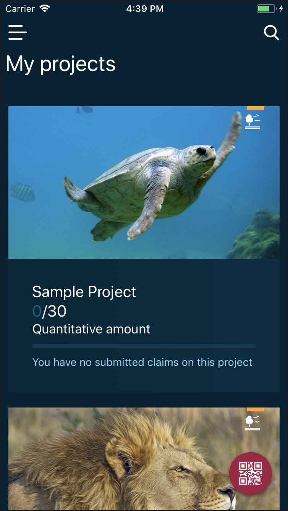
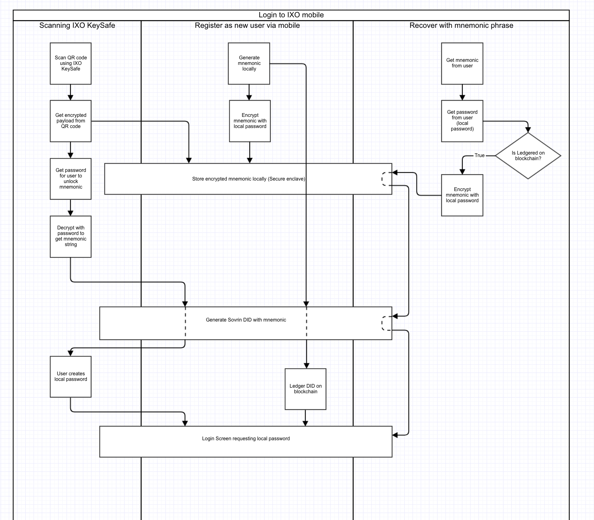

# IXO Mobile
## Setup
### Link native modules

```sh
react-native link
```

```sh
$ cd ios
$ rm -rf Pods
$ pod install
```

add RNRandomBytes manually
add RNIMagePicker manually
add RNSensitiveInfo manually
add react-native-vector-icons manually

### Development

#### IOS

```sh
react-native start or yarn run ios_dev ( You will need to cancel the metro bundler and start your own instance using react-start start)
```

#### ANDROID

```sh
react-native start or yarn run android_dev ( You will need to cancel the metro bundler and start your own instance using  react-start start)
```

### Production

```sh
yarn run ios_prod (ios)
yarn run android_prod (android)
```
#### Production build to local device
1.) Detect local phone using `ios-deploy --detect` (install ios-deploy npm globally `npm install -g ios-deploy`)
2.) Run locally `yarn run ios_prod --device "Max's iPhone"`

### Android Studio

#### Development
1. Make sure the project builds on from the android folder
2. Might need to do a cache reset (File -> Invalidate caches / restart)
3. Build the project to emulator / android device

#### Build a release version
1. Build -> Select Build Variant

## Screenshots



## Architecture

### Login security


## Native Libraries

* react-native-sensitive-info [https://www.npmjs.com/package/react-native-sensitive-info]
* react-native-camera [https://github.com/react-native-community/react-native-camera]
* react-native-permissions [https://github.com/yonahforst/react-native-permissions]
* react-native-image-picker
* react-native-fingerprint-scanner
* react-native-linear-gradient
* react-native-svg
* react-native-randombytes
* react-native-splash-screen
* react-native-video

## Contributing

Contributions welcome; Please submit all pull requests the against master branch. If your pull request contains JavaScript patches or features, you should include relevant unit tests. Please check the [Contributing Guidelines](contributng.md) for more details. Thanks!

## License

 - **MIT** : http://opensource.org/licenses/MIT
